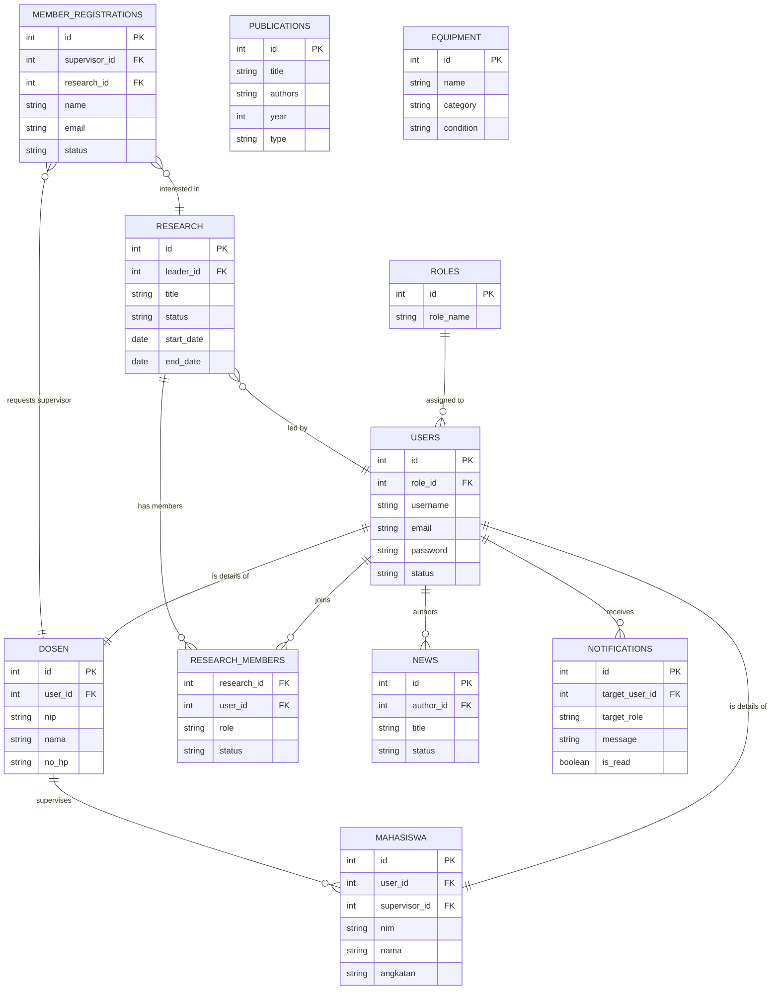

# Entity Relationship Diagram (ERD) - Lab IVSS

Dokumen ini menjelaskan struktur database dan hubungan antar entitas dalam sistem Lab IVSS.

## Conceptual ERD

## Deskripsi Entitas Utama

1. **Users & Roles**: Sistem menggunakan RBAC (Role-Based Access Control) sederhana. Tabel `users` menyimpan kredensial login, sedangkan detail profil dipisah ke tabel `dosen` dan `mahasiswa` (One-to-One).
2. **Research**: Entitas pusat aktivitas lab. Mahasiswa dan Dosen dapat bergabung dalam riset melalui tabel junction `research_members` (Many-to-Many).
3. **Registration**: Calon member mendaftar melalui `member_registrations`. Mereka memilih Dosen Pembimbing (`supervisor_id`) dan Topik Riset (`research_id`). Setelah disetujui, data akan dipindahkan ke tabel `users` dan `mahasiswa`.
4. **Content**: User (Admin/Dosen) dapat menulis berita (`news`).
5. **Inventory**: Peralatan (`equipment`) dan Publikasi (`publications`) dikelola sebagai data master terpisah.

## Tabel Pendukung (Utility Tables)
Tabel-tabel berikut bersifat mandiri untuk konfigurasi tampilan website:
- **system_settings**: Konfigurasi global lab.
- **navbar_settings**: Struktur menu navigasi dinamis.
- **footer_settings**: Konten footer & sosmed.
- **visimisi**: Data Visi dan Misi.
- **facilities**: Daftar fasilitas lab.
- **gallery**: Galeri foto kegiatan.
- **team_members**: Struktur organisasi tim lab (tampilan home).
