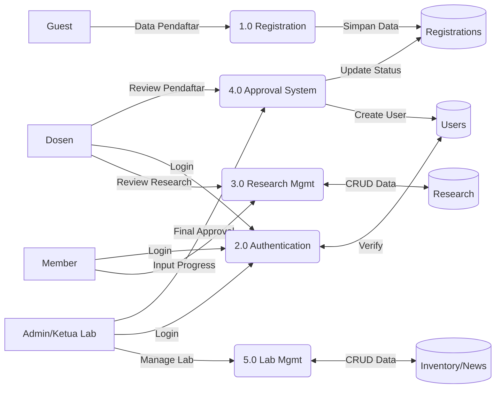

# Lab IVSS Portal

Portal manajemen Laboratorium Intelligent Vision & Smart System (IVSS) Politeknik Negeri Malang.

## � Fitur Utama

- **Manajemen User & Role**: Admin, Ketua Lab, Dosen, Mahasiswa.
- **Sistem Approval Member**: Pendaftaran member dengan persetujuan bertingkat (Dosen -> Ketua Lab).
- **Manajemen Riset & Publikasi**: Tracking riset dan publikasi dosen/mahasiswa.
- **Inventaris Lab**: Manajemen peralatan dan fasilitas lab.
- **Informasi & Berita**: Portal berita kegiatan lab.
- **Landing Page Dinamis**: Menampilkan profil, fasilitas, dan tim lab.

## 🛠️ Teknologi

- **Backend**: PHP Native 8.x
- **Database**: PostgreSQL 14+
- **Frontend**: Tailwind CSS, Vanilla JS

## 📦 Instalasi

1.  **Clone Repository**
    ```bash
    git clone https://github.com/hafisc/lab-ivss-pbl.git
    cd lab-ivss-pbl
    ```

2.  **Setup Database**
    - Buat database baru di PostgreSQL (misal: `lab_ivss`).
    - Import file `database/setup_database.sql`.

3.  **Konfigurasi**
    - Sesuaikan konfigurasi database di `app/config/database.php`.
    - Pastikan kredensial database (host, port, dbname, user, password) sesuai.

4.  **Jalankan**
    - Akses melalui browser: `http://localhost/Lab%20ivss/public/`

## � Akun Demo

| Role | Email | Password |
|------|-------|----------|
| **Admin** | `admin@ivss.polinema.ac.id` | `admin123` |
| **Ketua Lab** | `ketualab@ivss.polinema.ac.id` | `admin123` |
| **Dosen** | `budi.dosen@polinema.ac.id` | `admin123` |
| **Member** | `ahmad@student.polinema.ac.id` | `admin123` |

## 📂 Struktur Database

Terdiri dari 15 tabel utama:
1.  `roles` - Master data role
2.  `users` - Data akun pengguna
3.  `dosen` - Data detail dosen
4.  `mahasiswa` - Data detail mahasiswa
5.  `research` - Data penelitian
6.  `member_registrations` - Data pendaftaran member
7.  `news` - Berita lab
8.  `equipment` - Inventaris alat
9.  `system_settings` - Konfigurasi sistem
10. `publications` - Data publikasi
11. `notifications` - Notifikasi sistem
12. `research_members` - Anggota riset
13. `team_members` - Tim lab (tampilan home)
15. `gallery` - Foto kegiatan lab

## 🔄 Data Flow Diagram

Berikut adalah gambaran alur data dalam sistem (Simplified DFD):



## � Catatan

- Password default untuk semua akun demo adalah `admin123`.
- Pastikan ekstensi `pgsql` aktif di `php.ini`.
